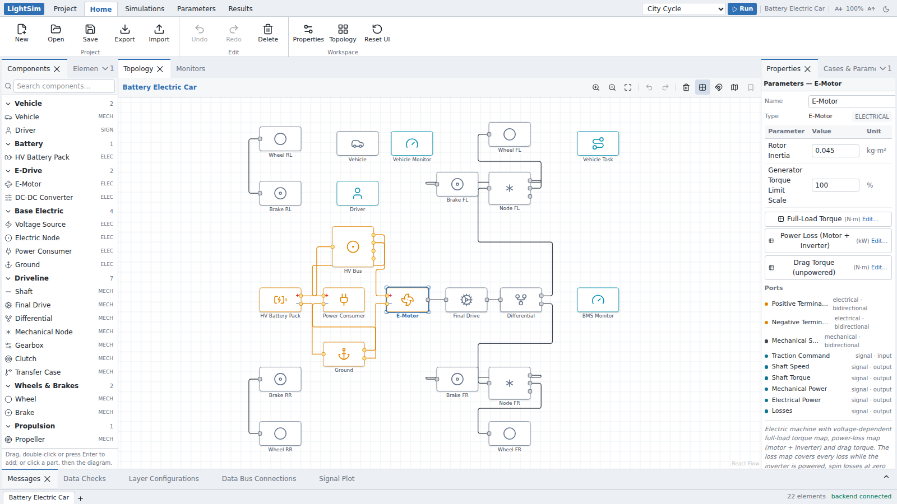
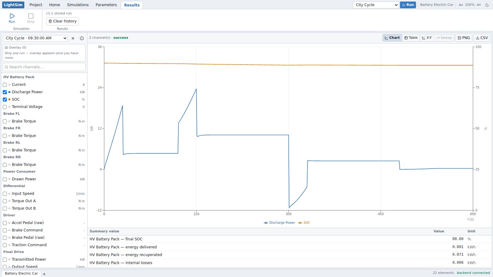
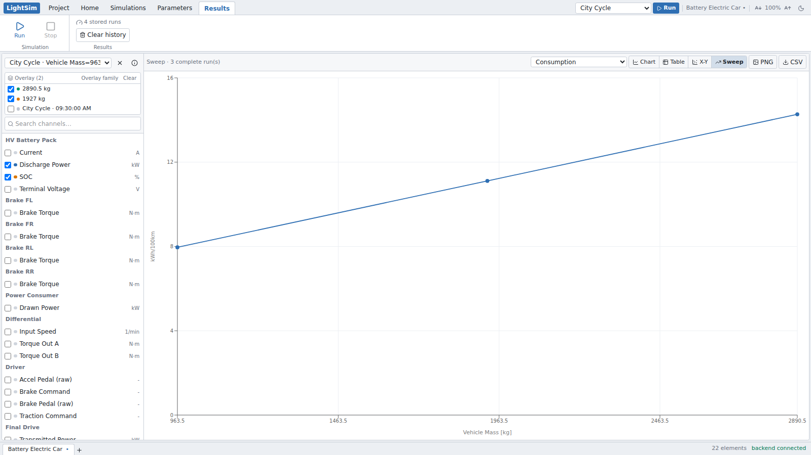
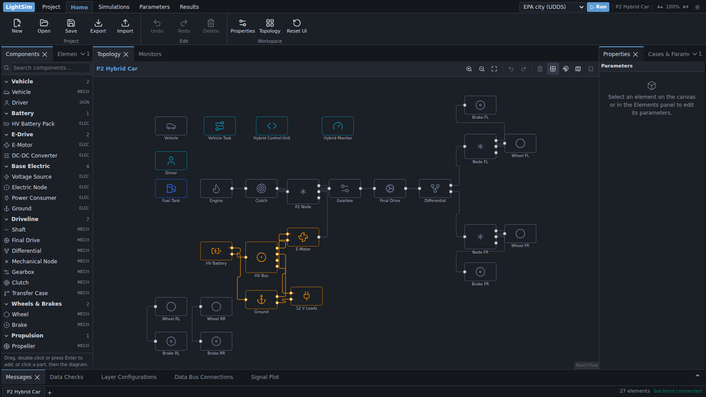

# LightSim — Vehicle System Simulation

LightSim simulates how much energy a vehicle uses, how far it goes and how
fast it accelerates. You build the car from parts on a diagram (battery,
motor, engine, gearbox, wheels, a driver), pick a driving cycle, press
**Run**, and watch the results come in. It is a desktop app for Windows and
Linux, runs entirely on your computer, and works offline.

> **Status:** early version. The workflow works, but the component physics
> are simplified, only the energy use of four electric cars on EPA's two
> test cycles has been compared with official results (within 8 %, with no
> tuning), and some results are known to be wrong. Read
> [Known issues and limits](docs/KNOWN-LIMITS.md) before relying on a number,
> and [What is validated](docs/VALIDATION-STATUS.md) for what has been
> checked and how. What changed in each version, and which results moved:
> [Release notes](docs/RELEASE-NOTES.md).

**Help:** in the app, press **F1** or open the **?** menu (top right) for
the built-in help: tutorials, Formula Student lessons, how-to guides, a
page for every part in the library and these documents, with a search box.
It opens in a panel beside your work and needs no internet connection. Its
pages are the Markdown in [docs/help](docs/help/index.md) and in docs/; the
tests check every number its tutorials and lessons quote against the app
(`docs/help/checks.json`).



## Quick start

1. **Download** the installer for your computer from the
   [latest release](https://github.com/Eyad-3D/simstudio/releases/latest):
   `LightSim-Setup-<version>.exe` for Windows 10/11, or the `.AppImage` or
   `.deb` for Linux. Nothing else is needed: the simulation engine is inside.
2. **Install and open it.** Until the installers are signed (see the release
   notes of your version), Windows warns the first time: choose *More info →
   Run anyway*. On Linux, make the AppImage runnable once
   (`chmod +x LightSim-*.AppImage`). The first time it opens, LightSim asks
   whether to check for updates; until you say yes it contacts nothing
   outside your computer.
3. **Run the example.** LightSim opens on its *Start* page: click the
   *Battery Electric Car*, an electric car modelled on the 2021 Cupra Born.
   Click any part on the diagram to see and change its values on the right,
   then press **Run** at the top right.
4. **Read the results.** The *Results* tab shows the run: consumption,
   distance and charge in the headline numbers above the chart (*All
   summary values* under it opens the full list), and a plot of the target
   against the actual speed, with the battery's charge and power; tick
   channels on the left to plot others.

   

5. **Ask "what if?".** In *Cases & Parameters* (the *Cases* tab, Home,
   right-hand side), choose a part and a value to sweep, here the car's mass,
   and press *Run sweep*. *Results → Sweep* plots a summary figure against it.

   

The *Start* page (and **Open**) lists a second example, a P2 hybrid sized
after the Hyundai Ioniq Hybrid and driven on the EPA city and highway
cycles, and a third, *FS Electric (generic)*, a Formula Student electric car
with a 75 m acceleration test, an autocross lap and an endurance energy
case, and a fourth, *Efficient Electric Sedan*, a Tesla Model 3 RWD class
car on EPA's test data that asks what low drag buys you, next to your own
projects; each example's entry lists the results to expect. **Home →
Templates** starts a new project from a pre-wired template with a short
form instead. Examples open as copies, so change them freely: **Save** keeps your
copy as a project of your own. To watch a run as it happens, pick the *City Cycle (live, 10×)* case and
change values while it runs (try the Driver's P and I gains, or lock the
Differential).

## Features

| Area | What works |
|---|---|
| **Topology builder** | Drag components from the searchable library tree onto a React Flow canvas, or add one with Enter, a double-click or click-to-place; connect ports (kind-checked), pan/zoom with a zoom readout (Fit / 50 / 100 / 200 %) and part names that stay readable at any zoom, multi-select, delete, undo/redo (Ctrl+Z / Ctrl+Y), minimap toggle |
| **Component library** | Declarative catalog in `backend/app/library/components.json` with mandatory units on every parameter (dimensionless = `-`) and first-class lookup tables (`table1d` / `table2d`, dict-keyed by the independent variable). Every parameter has a plain-words description, typical values and where to find the real number, shown in a card when the pointer rests on it or it has focus in Properties or the parameter dialog; number parameters carry their limits (`minimum`, `exclusiveMinimum`, `maximum`), which turn a field red as it is typed and which Data Checks read too |
| **Dynamic solver** | Causal multi-pass solver with real states: vehicle speed integrates from net tire force, per-wheel speeds with a longitudinal slip tire model, battery SOC from an equivalent-circuit model, semi-implicit Euler with solver steps of at most 10 ms. Controllers, scripts, the drive cycle, gear choice and the physics all run at every solver step (Script, PID and Lookup blocks can be given a slower *Sample Time*), and motors are held to what their battery, fuel cell or voltage source can supply. The case time step only sets how often results are stored (see [Solver](#solver)) |
| **Differential** | Locked/unlocked with genuinely different dynamics: unlocked = equal torque split with free output speeds (one wheel on ice spins up), locked = common speed with grip-dependent emergent torque split |
| **Drive cycles** | The Driving Task drives one of 27 standard drive cycles (the WLTC classes 1 to 3b with their city cycles and phases, the NEDC, EPA's FTP-75, city UDDS, highway HWFET, US06, SC03, LA92 and New York City cycles, the WMTC and EPA motorcycle cycles, and a long-haul truck route with its grade; bundled in `backend/app/cycles/`, each with its source) or a profile of typed points, against time or (with *Profile Axis* set to Distance) against the distance driven, as a lap or route is given; a case over distance can end after a number of *Laps*; Properties sketches it with its phases, duration, distance and top speed. Choosing a cycle sets the length of the cases that drive it (when the model has one Driving Task, or for the case it is picked in), a case can pick its own, and the library search finds cycles by name |
| **Driver** | Separate Driver component (speed-following PI): wire a target-speed profile and the Vehicle's speed into it; braking blends recuperation (motor generator quadrant, what the battery or other source can take back) before friction brakes |
| **Live simulation** | Runs stream over a WebSocket: progress + all channels update live, the solver can be paced against real time (Pacing selector), cancelled, and scalar parameters (e.g. driver PI gains) can be edited mid-run from the Properties panel |
| **Monitors** | Display-only Monitor component: add named signal inputs, wire anything into them, get live readout cards + sparklines in the Monitors panel |
| **Scripting** | Script (Function) component: user-written Python `step(t, dt, inputs, state, params)` with named per-instance ports — for hybrid control strategies, custom recuperation logic, signal math. `step()` is called every solver step with `dt` = that step (0.01 s unless the case time step is shorter), or at the block's *Sample Time* with `dt` = the Sample Time when that is longer; wired inputs are fresh on every call. Scripts get `math`, `clamp()` and `interp()` and a small set of builtins; other imports, file access, class definitions and dunder attributes are refused, and each call must return within 2 s. During a run, scripts execute in a separate process that the engine stops if a call overruns, with a 512 MB memory cap; on Linux 5.13+ the kernel (Landlock) also blocks its file access, and on Linux 6.7+ its TCP connections. What each platform does and does not block: [Known issues and limits](docs/KNOWN-LIMITS.md) |
| **FMU parts** | Drop an FMU file (a Co-Simulation FMU of FMI 2.0 or 3.0 from Simulink, Dymola, GT-SUITE or a supplier) on the diagram, or choose one in an *FMU* block, and it runs with the rest of the model. *Properties* show its FMI version, kind, exporting tool, a platform badge (*Runs here*, *Windows only*, *Source only*) and FMPy's validation findings in plain words; *Variables and pins* ticks FMU variables into signal pins (wired on the Data Bus) and sets start values, which are ordinary parameters (so a case can change them). Each FMU runs only once you allow it on your computer, in a process of its own hardened like the Script process, so a crash or hang stops the run, not the engine. Needs the optional FMU pack (`backend/requirements-fmu.txt`, FMPy BSD-2-Clause); see [Use a model from another tool](docs/help/how-to/use-an-fmu.md) |
| **Maps** | E-Motor with voltage-dependent full-load torque map, power-loss map and unpowered drag torque; combustion engine full-load curve, fuel map and unfired drag torque; battery OCV(SOC) table — all edited in table grids in the Properties panel |
| **Problems** | One list of every problem the model has now: the Data Checks, which run by themselves a moment after a project opens and after every change, and the latest run's warnings and errors, each with a "How to fix" line; a click or Enter selects the part(s) it is about and zooms the diagram to them, and the status bar counts the errors. Data Checks are pre-run validation: reference integrity, port-kind mismatches, parameter limits (from the catalog, also for a case's own values), table data, drive-cycle and road-profile entries (an entry that is not an `x:value` pair of numbers, or points out of order, is an error; a repeated x is a warning), Sample Times (negative or not a finite number is an error, above 0.1 s a warning), script compilation (compile only — script code never runs during checks), driveline solvability (delegated to the solver's model extraction). Errors that block the run when the model cannot drive: an E-Motor with no power source, a motor or engine that reaches no wheel, an open differential with a free output, a missing command or target-speed signal, a speed demand that reaches no motor or engine, two signals wired into one input, a CG height while all wheels are on one axle, and for a lap case a missing Race Track or E-Motor, wheels all on one axle, an engine or clutch on the wheels, Laps that are not a whole number from 1 to 500, and a Custom curvature table that does not start at 0 m, is shorter than 10 m or bends tighter than 0.5 1/m. Warnings for parts the solver would leave out (unconnected, or an input that silently reads 0) and for implausible values (vehicle mass, battery size, auxiliary load, final-drive ratio, wheel load shares that do not add up to 100 %, which the solver scales to 100 % (a 0 % total is an error), a CG height above the wheelbase, a battery that starts empty; for a lap case, a gearbox held in its gear and a Custom closed track that does not close). An all-clear says what was checked; it does not vouch for the results |
| **Results** | Dedicated full-page Results workspace (own ribbon tab): channel picker grouped per element, headline numbers above the chart (consumption or fuel, distance, charge and energy; a test's time and speed, with its pass or fail), multi-channel time-series **chart or table view** that fills in live during the run and opens on target against actual speed, with zoom and pan on every chart (mouse wheel, a dragged box, Shift+drag; a double-click shows the whole run), each y axis fitted to its data (*Axes* starts one at 0 or sets its ends) and the x axis in s, min or h or against the distance driven, measurement cursors A and B (*Cursors* or C; typed times, the arrow keys or a dragged line) with each signal's values there, the difference, and its minimum, maximum, mean, RMS and integral between them (kWh from kW) and a time-to-reach form (0 to 100 km/h), the full summary table under the chart (SOC, energy, recuperation, distance, consumption, fuel and CO₂ per km, electrical energy balance error, time a motor was held back by its supply, regeneration a motor's supply could not take) with a *not valid* note on figures the run's checks rule out (see [Run status](#run-status-and-not-valid-figures)), CSV export along the chart's x axis. Each run keeps a copy of the model and case settings it ran with, the app version and the parameters edited while it ran; *Run info* (ⓘ next to the run picker) shows them and opens that model again as an unsaved copy. A run of a case is compared with the previous one (or another run picked as the *Baseline*): it is named after what changed (*Vehicle Mass 2,300 kg*; the name and a note can be edited in *Run info* and are stored with the run), the baseline is drawn faint and dashed with it, the headline numbers and the summary give the change and % change (*~ 0* within the rounding of a run stored before 0.3), and *What changed* lists the edits between the two, each part a click from the diagram. Each case keeps its ticked channels, view, axes and zoom across runs and restarts, and a new run keeps the runs you overlaid. Point 0 is the initial state at t = 0, each later point holds the state at its own time, and the run ends exactly at the case duration (an Acceleration case at the end of the solver step that reaches its line; a Lap case when its laps are driven, whatever the duration). **Energy** shows where the battery's or fuel's energy went as a Sankey chart and per part (in, out, lost; CSV and SVG), **Duty** each motor's, battery's and engine's highest, mean and RMS power, torque and current, and a band under the chart what held the car back (tyre grip, the motor or engine, the battery or a set power limit). The diagram's lightning button labels each part with its energy, and parts changed since the run shown get a dot while Results says how many changes the run is from before |
| **Parameter studies** | Per-case parameter overrides and one-parameter sweeps of up to 200 points (Cases & Parameters panel), run side by side on the computer's processor cores. Each sweep is kept as a study, with the project's runs and not in the model file: what was swept on which case, and its results table with a row per point (value, status, run, every summary value; CSV download), kept after its runs leave the Results history |
| **Electrical** | Two-terminal components: every electrical element has explicit positive (+, red) and negative (−, blue) pins; the solver balances power on the supply rail with the negative terminals as the return (wire to Ground, or leave implicit) |
| **Canvas** | Signal/data-bus wiring is edited in the Data Bus panel, one row per signal input with a searchable box that offers the outputs (those that share a word with the input's name first, then its unit), so a link is two clicks; a part's right-click menu has *Signals…*; links between two inputs or two outputs are refused; an optional dashed overlay draws those links on the canvas (the *signal* layer in Layer Configurations, off by default); background-grid toggle; double-click an element for a modal parameter dialog; Shift+click a pin to move it to the next side of its node, Shift+drag a pin to slide it anywhere along the node's edges (Shift+drag elsewhere draws a selection box) |
| **Files in and out** | Results as a MATLAB `.mat` file (a struct per part with its channels, units and the run's details; read by MATLAB and SciPy), CSV that Excel opens with its units intact, `matlab/lightsim_run.m` to run a case from a MATLAB script, and a command line (`lightsim-backend run|export|import-table|params`). Every table, map and drive profile reads from a CSV or Excel file with a preview and unit conversion; every parameter of a model goes out to one Excel sheet and back with a list of changes ([help](docs/help/how-to/use-results-in-matlab-and-python.md)) |
| **Persistence** | Save/load projects on the backend (single JSON file per project), plus browser Export / Import; the last 20 saved versions of each project can be restored as a copy (Project → Restore…) |
| **AI assistants** | *Copy for AI* (Project tab) copies a short Markdown summary of the model and its last run (under 8 KB; *Hide values* hides the numbers) to paste into any chatbot; nothing is sent. `lightsim-backend mcp` is a local MCP server (stdio, no network port) with nine tools to list, outline, check, run, query, compare, explain and edit models, read-only unless the user confirms in the AI app; *Connect AI* adds it to Claude, VS Code, Copilot, Codex, Gemini or Cursor with one click (or `lightsim-backend mcp install --client <app>`). A skill pack in the Agent Skills format (`backend/app/ai/skills/`) teaches assistants how to model in LightSim. Code: `backend/app/ai/`; how to use it: [Use an AI assistant](docs/help/how-to/use-an-ai-assistant.md) |
| **Help** | Built-in help pages served by the engine at `/help/` (so they work offline) and shown in a Help panel inside the app (**Open in browser** hands a page to the system browser): F1 opens the focused parameter's place on its part's page, else the selected part's page, else the focused panel's how-to page or the front page; each panel's **?** opens its page, the header's **?** menu and the desktop app's *Help* menu list the main pages, and the release notes open once after an update. A first-steps tour (driver.js) and a step bar guide new users. Tutorials, how-to guides, a generated page per library part (ports, parameters with an anchor each), the drive cycles and the examples, the README's quick start, solver and API sections, and the docs/ pages, with a search over every page. `frontend/scripts/build-docs.mjs` builds them before `npm run dev` and `npm run build`, and fails on a link to a page or heading that does not exist |
| **UI shell** | A *Start* page at launch and on **New**: continue with the open project, start from an example (with the results to expect) or a blank project, or reopen one of the 8 projects saved last (with the date, the number of parts and a sketch of the diagram); *Skip this page* opens the last project instead, and restored unsaved work always opens on Home. Empty panels offer the next step (the empty diagram *Add a part* and *Start from an example*, Monitors *Place a Monitor*, Results a button that runs the active case by name, such as *Run 'City Cycle'*). Ribbon tabs act as full-page workspaces (Home = topology + panels; Results = its own page); light/dark theme (persisted); dockable & resizable panels (Dockview) around a large diagram, with Messages, Problems, layers, Data Bus and Signal Plot in a collapsible bottom tray (double-click a tab to maximise its group); status bar with live progress |



## Install the desktop app

LightSim ships as a normal desktop application — download, install, launch.
Python and Node are **not** required: the simulation engine is bundled inside.

| Platform | Download |
|---|---|
| Windows 10/11 (x64) | `LightSim-Setup-<version>.exe`, or `LightSim-<version>-x64.msi` for company IT |
| Linux (x64) | `LightSim-<version>-x86_64.AppImage` or `LightSim-<version>-amd64.deb` |
| macOS (Apple silicon) | `LightSim-<version>-arm64.dmg`, only once the Mac build can be signed and notarised by Apple: until then there is none |

Download the installers from the
[Releases page](https://github.com/Eyad-3D/simstudio/releases), with a
`.sha256` checksum for each file. On Linux, mark the AppImage executable once
(`chmod +x LightSim-*.AppImage`) and run it. To install a newer version,
let LightSim check for updates (it asks the first time it opens, and
**Help → Updates** changes the answer; see
[Turn update checks on or off](docs/help/how-to/check-for-updates.md)), or
download it and install it over the old one. Your projects stay where they
are.

To install LightSim on many PCs at once, for all users and without
questions, and to fix settings for everyone with a policy file, see
[Install LightSim for a lab or a company](docs/help/how-to/deploy-for-it.md).

> Builds made without the owner's signing certificate are unsigned, so
> Windows SmartScreen warns on first launch: choose *More info → Run
> anyway*. A signed release says so in its release notes.

Builds of changes not released yet come from the **Build desktop app**
workflow: on the repository's **Actions** tab, open the latest successful
*Build desktop app* run on `main` and download the `lightsim-windows` or
`lightsim-linux` artifact (a zip with the installers and their checksums; you
need to be signed in to GitHub, and artifacts expire after 90 days).

### Where your work is saved

Projects are stored one JSON file each, in your own user folder, so they
survive reinstalls and upgrades. **File → Open Projects Folder** opens it.
A project can also be a `.lightsim` file in any folder, such as a git
repository or a course folder: **File → Save As…**, **File → Open…**, a
double-click on the file or a drop on the window (desktop app). Its runs,
backups and attached files sit next to it in `<name>.lightsim-runs/`,
`<name>.lightsim-backups/` (both ignored by git) and
`<name>.lightsim-resources/`; see
[Keep a project in a folder of your own](docs/help/how-to/save-in-any-folder.md).
Running a case or a sweep never changes a project file.

Every file records its format version and the LightSim that saved it. An
older file is upgraded step by step when it opens (the first save keeps
the old file as `pre-migration-v1.json` in its backups); a file from a
newer LightSim opens read-only, so nothing in it is lost.
FMU files you import are kept in its `fmus` folder (unpacked in `fmus/unpacked`), with the list of FMUs
you allowed to run on this computer (`fmus/allowed.json`).

| Platform | Location |
|---|---|
| Windows | `%APPDATA%\LightSim\projects` |
| Linux | `~/.config/LightSim/projects` |

The examples are not copied there: they are part of the app, read-only,
and every update brings the current ones. The Open menu lists them under
*Examples*, apart from *Your projects*. An example opens as an unsaved copy
with an id of its own, so saving it makes a new project (and its runs and
backups are its own) and never changes the example. To take an example out
of the menu, hide it (the eye icon next to it); *Restore hidden examples*
lists it again. Copies of the examples that earlier versions put in your
projects folder stay there as your own projects, as you left them; an
example whose copy you had deleted starts out hidden.

Before version 0.2.0 the app was called SimStudio and kept its projects in
`%APPDATA%\SimStudio\projects` (Windows) or `~/.config/SimStudio/projects`
(Linux). On its first launch LightSim copies that folder, with the runs,
backups and hidden examples, into its own, as long as its own has nothing in
it yet (`main.log` in LightSim's folder records the copy). The old folder is
left as it was: delete it once you have checked your projects in LightSim.
The window's settings (theme, font size, panel layout) and an unsaved
recovery draft stay behind, so save your work in SimStudio before you switch.

A save replaces the file in one step, so a crash or a full disk mid-save never
leaves a half-written project, and the version it replaced is kept next to it
as `<id>.json.bak`. If the file changed after you opened it (saved from a
second window, or edited by another program), Save asks before overwriting it.

Every save also keeps the version it replaced in the hidden `.backups/<id>/`
folder, the last 20 per project. **Project → Restore…** lists them by the
time each was saved and opens the one you pick as an unsaved copy: the
project file is left as it is, and saving the copy makes a new project.

## Known limitations

[docs/KNOWN-LIMITS.md](docs/KNOWN-LIMITS.md) is the maintained list,
including the open bugs that change results and how to work around them; the
app shows it in its help (**Help → Known Limits**, or F1). The structural
limits in short:

- One differential and one E-Motor per driveline subgraph (multiple
  independent drivelines — e.g. dual-motor AWD as two axles — work).
- One battery or voltage source per electrical bus; DC-DC is unidirectional.
- Forward driving only (no reverse), no thermal/fluid solving.
- FMU blocks run Co-Simulation FMUs only, with single-number pins, and the
  FMU file is kept beside your projects, not inside the project file.
- Sub-system containers are organizational: physical connections cannot cross
  a container boundary (signals can, via the Data Bus).
- The canvas bookmark tool is disabled, and the Optimization tab is hidden
  until it is implemented. (Parameters — per-case overrides and sweeps —
  works.)

## Building the app from source

One command builds the UI, freezes the backend, and produces an installer for
whichever OS you run it on. Requires Python ≥ 3.11 and Node ≥ 20.

```bash
./scripts/build-desktop.sh          # Linux, or macOS (unsigned: your own Mac only)
.\scripts\build-desktop.ps1         # Windows
```

Installers land in `desktop/release/`. Add `--dir` (or `-Dir`) for just the
unpacked app, which is much faster while iterating. Before packaging, the
build writes `THIRD-PARTY-NOTICES.txt` and `sbom.cdx.json`, and stops if
anything it would ship is under a licence LightSim does not allow (see
[Third-party licences](#third-party-licences)).

Neither half cross-compiles — the frozen Python backend and the Electron
package are both platform-specific — so `.github/workflows/desktop-build.yml`
builds Windows, Linux and macOS (Apple silicon) on GitHub's runners. To draft
a release with the installers attached, run it on `main` from the **Actions**
tab with *release* ticked (the `v<VERSION>` tag is made when the draft is
published), or push a `v*` tag that matches `VERSION`. The release starts
its update rollout at 10 % of the installs that agreed to update checks
(the *rollout* box); the **Update rollout** workflow raises it to 50 % and
100 %, or to 0 % to stop offering a bad release.

### Signing the installers

Signing needs certificates that cost money, so the workflow signs only when
the repository has these secrets (**Settings → Secrets and variables →
Actions**), and builds unsigned without them:

- **Windows** (signs every program file, the engine's libraries, the
  installers and the MSI; `desktop/build/sign-windows.cjs`). Either Azure
  Artifact Signing (about US$10 a month; individuals must be in the US or
  Canada): secrets `AZURE_TENANT_ID`, `AZURE_CLIENT_ID`,
  `AZURE_CLIENT_SECRET` and variables `LIGHTSIM_AZURE_ENDPOINT`,
  `LIGHTSIM_AZURE_ACCOUNT`, `LIGHTSIM_AZURE_PROFILE`; or any other signing
  tool, such as an OV certificate in a cloud key store: the secret
  `LIGHTSIM_SIGN_COMMAND`, a command with `{file}` where the file goes. Set
  the variable `LIGHTSIM_WIN_PUBLISHER` to the certificate's name, so updates
  are checked against it. Keep the same certificate across releases:
  SmartScreen trusts a publisher as its downloads build a history.
- **macOS** (Apple Developer Program, US$99 a year): secrets `MAC_CSC_LINK`
  (the Developer ID Application certificate as base64 .p12),
  `MAC_CSC_KEY_PASSWORD`, `APPLE_API_KEY` (the App Store Connect API key's
  .p8 text), `APPLE_API_KEY_ID` and `APPLE_API_ISSUER`. Without them the Mac
  build is made and tested but never published.

On Windows the workflow checks every signature with `signtool`, scans the
build with Microsoft Defender, installs it silently for all users and
starts it, and installs, upgrades and removes the MSI. Before each release,
also submit the installer and `lightsim-backend.exe` to Microsoft's
[malware submission portal](https://www.microsoft.com/wdsi/filesubmission)
as a software developer, so Defender learns them before users download them.

## Developing

Two processes: a FastAPI backend (solver, validation, library, persistence)
and a Vite dev server (UI). The Vite server proxies `/api` (HTTP and
WebSocket) to the backend.

```bash
# 1. backend  (Python ≥ 3.11)
cd backend
pip install -r requirements.txt
python -m uvicorn app.main:app --reload --port 8000

# 2. frontend (Node ≥ 20)
cd frontend
npm install
npm run dev            # → http://localhost:5173
```

In this mode your projects (with their runs and backups) are saved in
`backend/dev-projects/`, which git ignores, not in your user folder. The
examples are read from `backend/projects/`, which the engine never writes (the
golden tests read them too): to change an example, edit its file there.
Projects that earlier versions saved into `backend/projects/` now show up as
examples; move them to `backend/dev-projects/`. If the backend is not running
the UI still works from bundled data (topology editing only); save / checks /
simulation are disabled and a warning appears in Messages.

Building the frontend once (`cd frontend && npm run build`) also lets the
backend serve the whole app at `:8000` with no Vite process. To run the
Electron shell against your working tree, do that and then `cd desktop && npm
install && npm start` — the shell prefers the frozen backend in
`backend/dist/` when present and otherwise falls back to `python3` on PATH, so
no packaging step is needed while developing.

### Tests and checks

```bash
cd backend
pip install -r requirements-dev.txt ruff
python -m pytest tests/     # maps, dynamics, differential modes, scripts, API + WS
ruff check .                # lint (config in backend/pyproject.toml)

cd ../frontend
npm run lint                # ESLint (config in frontend/eslint.config.js)
npm test                    # unit tests (Vitest)
npm run build               # type-check + production build (and the help pages)
npx playwright install chromium   # once
npm run test:e2e            # browser + accessibility tests of the built UI

cd ../desktop
npm test                    # the shell's unit tests (plain Node, no install needed)
```

FMU parts (STD-01) need the optional FMU pack. Install FMPy without its
declared dependencies (cmake, jinja2 and nbformat are only for compiling
FMUs), then point the tests at the Modelica Association's Reference FMUs to
check every Co-Simulation one against FMPy's own results, as CI does:

```bash
cd backend
pip install -r requirements-fmu.txt
pip install --no-deps fmpy==0.3.32
# unpack https://github.com/modelica/Reference-FMUs/releases (BSD-2-Clause)
LIGHTSIM_REFERENCE_FMUS=/path/to/Reference-FMUs-0.0.39 python -m pytest tests/test_fmu.py
```

`tests/test_fmu.py` also builds a small test FMU with the system C compiler
(skipped where there is none, as on Windows).

The browser tests start the engine themselves with `python3` (set
`LIGHTSIM_PYTHON` to use another interpreter; it needs the backend's
requirements) and a throw-away projects folder. They include screenshot
comparisons: after a deliberate UI change, regenerate the baselines on CI
(Actions → CI → Run workflow, tick *Regenerate the screenshot baselines*),
since renders from another machine do not match the runner's.

Two smoke tests exercise what unit tests cannot — they run the *built*
artefacts rather than the source (Node ≥ 22, for its built-in WebSocket):

```bash
node scripts/smoke-backend.mjs    # the frozen executable: library, examples,
                                  # a REST run and a live WebSocket run
xvfb-run -a node scripts/smoke-app.mjs \
  desktop/release/linux-unpacked/lightsim   # the packaged app reaches its engine
```

These exist because a frozen build can be missing a module that every unit
test passes without — that is exactly how a broken live-run WebSocket nearly
shipped.

### Versioning

The root `VERSION` file is the single source of truth. `scripts/sync-version.mjs`
copies it into the npm manifests (electron-builder and Vite each insist on
reading their own `package.json`), and the backend reports it at
`/api/health`. CI fails if they drift, and also when
[docs/KNOWN-LIMITS.md](docs/KNOWN-LIMITS.md) was last reviewed for another
version: review the page for each release and update its *Last reviewed*
line (the script checks that line but never rewrites it).

```bash
node scripts/sync-version.mjs           # write VERSION into the manifests
node scripts/sync-version.mjs --check   # what CI runs
```

### Third-party licences

The app ships other people's open-source code: the UI's npm packages,
Electron and any runtime dependencies of the desktop shell, and everything
PyInstaller freezes into the engine (Python
packages, the Python runtime and native libraries such as OpenSSL).
`scripts/third-party-notices.py` lists all of it, with the licence texts, in
`THIRD-PARTY-NOTICES.txt` (**Help → Third-Party Notices** in the app), and as
a CycloneDX software bill of materials in `sbom.cdx.json`; the installers
include both. It fails if any of it is under a licence that
[`scripts/licenses/allowed.txt`](scripts/licenses/allowed.txt) does not
allow, or under a licence it cannot determine. GPL, AGPL, SSPL and EUPL are
always refused; the two GPL-licensed parts that do ship come with an
exception that permits it (the PyInstaller bootloader and, on Linux, the GCC
runtime library). What is built into Electron itself (Chromium, Node.js) is
not checked here: Electron ships those notices as `LICENSES.chromium.html`
next to the executable. Build tools whose code does not ship are not listed
either, such as `marked`, which turns the help's Markdown into HTML.

The desktop builds (the workflow and both build scripts) write both files
afresh before packaging, and the CI licence check runs on every pull request
and every push to `main`. To regenerate them by hand, and commit the result
when the dependencies change:

```bash
cd backend
pip install -r requirements-build.txt   # includes pip-licenses
python -m PyInstaller --noconfirm --distpath dist --workpath build lightsim-backend.spec
cd ..
npm ci --prefix frontend && npm ci --prefix desktop   # desktop/ pins the npm licence reader
python scripts/third-party-notices.py   # add --check to only check
```

If the check fails on a package whose metadata names no licence the script
can read, or names several without an SPDX expression (the script then
requires all of them, since the list does not say whether they are a
choice), check its licence file and record it in
`scripts/licenses/clarifications.json`. A native library it does not know
goes in `scripts/licenses/bundled-runtime.json`. Adding a licence to
`allowed.txt` is a licensing decision for the owner, not a build fix.

### Continuous integration

| Workflow | Runs on | Does |
|---|---|---|
| `ci.yml` | every push and PR (~3 min; the browser tests ~6 min, in parallel) | backend lint + tests, frontend lint + unit tests + typecheck + build, browser + accessibility tests, version-sync check, third-party licence check |
| `desktop-build.yml` | `main`, `v*` tags, manual, and PRs touching packaging (~12 min) | builds Windows (setup program and MSI), Linux and macOS installers (with their third-party notices), signs them when the secrets exist, smoke-tests the frozen backend and the packaged app (which must contact nothing outside the computer), tests the Windows silent and MSI installs and a Defender scan, uploads artefacts with SHA-256 checksums |
| `update-rollout.yml` | manual | raises or pulls a release's staged update rollout |

Push a `v*` tag to draft a release with the installers attached. Dependabot
opens grouped dependency PRs monthly.

## Architecture

```
frontend/  React 19 + TypeScript + Vite
  ├─ Dockview        dockable panel shell (library / canvas / properties / bottom tabs)
  ├─ React Flow      topology canvas with custom element nodes & kind-colored edges
  ├─ Zustand         project graph, selection, undo history, live run state, results
  ├─ uPlot           results charts on a canvas (live-updating, zoom and pan)
  ├─ Tailwind CSS    dense engineering-tool styling
  └─ scripts/build-docs.mjs   the help pages: docs/help/, README sections, docs/,
                              the catalogue and the cycles → public/help (marked)

backend/   Python + FastAPI
  ├─ app/main.py                   HTTP + WebSocket API (FastAPI app)
  ├─ app/library/components.json   declarative component catalog (ports, params with
                                   limits and help texts, maps)
  ├─ app/library/tracks.json       the Race Track's layouts, drawn for LightSim
  ├─ app/cycles/                   bundled standard drive cycles (a CSV each, cycles.json), read by app/cycles.py
  ├─ app/schemas.py                pydantic models mirroring the shared JSON data model
  ├─ app/solver/                   causal multi-pass solver package
  │    ├─ maps.py                  shared table parsing + 1D/2D interpolation
  │    ├─ profiles.py              driving-task profile parsing
  │    ├─ network.py               model extraction: rigid segments, buses, signal routes
  │    ├─ scripting.py             Script component compile/run
  │    ├─ runtime.py               shared constants, signal routing, small linear solver
  │    ├─ slave.py                 FMI-style co-simulation slave interface
  │    ├─ master.py                co-simulation master: steps the slaves on a shared grid
  │    ├─ domains.py               domain slaves: control → gear → source limits → driver → mechanics + vehicle → electrical
  │    ├─ verdict.py               run verdict: speed trace vs. target, distance, non-finite values
  │    ├─ lapsim.py                lap mode: quasi-steady-state lap solver and its energy pass
  │    └─ core.py                  simulate(): runs the master, records channels, streams progress
  ├─ app/validation.py             "Data Checks" pre-run validation
  ├─ app/storage.py                one JSON file per project
  ├─ app/paths.py                  bundled vs. user-writable location resolution
  ├─ app/security.py               Host / Origin / launch-token checks on every request
  ├─ app/server.py                 entrypoint the desktop shell launches (or the CLI, given a command)
  ├─ app/api_docs.py               the offline API reference page at /docs
  ├─ lightsim/                     Python package + `lightsim` CLI: run, check, read results, edit;
  │                                AI access rules (ai_access.py); JSON Schemas (spec.py)
  ├─ lightsim-backend.spec         PyInstaller recipe for the frozen backend
  └─ projects/                     example projects (aero-bev.json, bev-car.json, hybrid-car.json, fs-electric.json)

desktop/   Electron shell
  ├─ src/main.js                   starts the backend on a stable loopback port
  │                                with a per-launch token, waits for
  │                                /api/health, then opens the window
  ├─ src/loading.html              splash shown while the engine starts
  ├─ src/old-projects.js           first launch: copies the projects saved under the old name
  └─ electron-builder.yml          installer definitions (NSIS / AppImage / deb)
```

In the packaged app the backend serves the built UI as well as the API, so the
window talks to a single local origin and the frontend's relative `/api` calls
— including the live-simulation WebSocket — work unchanged. Nothing is exposed
off the machine: the server binds to 127.0.0.1. Each installation picks a free
port on first launch and keeps it (choosing a new one only if another program
takes it), so the UI's saved layout and settings persist across restarts.

Web pages the user visits can still reach a loopback port, so the engine
answers only requests addressed to `127.0.0.1` / `localhost` (no DNS
rebinding), refuses any request whose `Origin` is not its own (the Vite dev
server's is allowed in development), and in the desktop app requires a
random per-launch token: the shell passes it to the engine in
`LIGHTSIM_TOKEN`, and the window receives it as an HttpOnly, SameSite=Strict
cookie on its first page load. Without `LIGHTSIM_TOKEN` (development) there
is no token check. To reach a development engine through another host name
(e.g. a forwarded port), list it in `LIGHTSIM_ALLOWED_HOSTS` (comma-separated).

### API

| Method & path | Purpose |
|---|---|
| `GET /api/library` | Component definitions |
| `GET /api/cycles`, `GET /api/cycles/{id}` | The bundled drive cycles (name, region, phases, duration, distance, top speed) / one of them with its trace (`t` in s, `v` in km/h) |
| `GET /api/projects` | List your saved projects |
| `GET/PUT/DELETE /api/projects/{id}` | Load / save / delete a project. GET adds the file's `revision` (also sent as the `ETag`); a PUT with `If-Match: "<revision>"` is refused with 409 if the file changed since, and `If-None-Match: *` refuses to replace an existing project |
| `GET /api/examples` | List the examples shipped with the app, each with `hidden` (hidden from the Open menu) |
| `GET /api/examples/{id}` | Load an example as shipped (read-only: no `revision`; the UI opens it as a copy with a new id) |
| `POST /api/examples/{id}/hide`, `POST /api/examples/restore` | Hide an example from the Open menu / list every hidden one again |
| `GET /api/templates`, `POST /api/templates/{id}/new` | Vehicle templates (built-in and your own) / a new project from one, with its form's `values` |
| `POST /api/templates`, `DELETE /api/templates/{id}` | Save a model as a template of your own / delete one |
| `POST /api/label-estimate` | US window-sticker estimate (not certified) from UDDS and HWFET runs, every step listed |
| `POST /api/vehicle-tests` | One-click vehicle tests (`tests`: `accel_0_100`, `accel_80_120`, `top_speed`, `constant_speed`, `gradeability`, `coast_down`) |
| `GET /api/projects/{id}/revision` | The revision of the project's file on disk now (the UI notices outside changes with it) |
| `POST /api/projects/upgrade` | An imported file's JSON in the current format, with the studies an upgrade took out of it |
| `GET /api/files`, `DELETE /api/files/{id}` | `.lightsim` files opened or saved anywhere (Recent files) / take one off the list |
| `POST /api/files/open`, `POST /api/files/save-as` | Remember a `.lightsim` file the user picked, by path (desktop shell only: they need its secret) |
| `GET /api/projects/{id}/studies`, `PUT/DELETE …/studies/{study}` | A project's parameter studies, kept with its runs |
| `GET/POST /api/projects/{id}/attachments`, `GET/DELETE …/attachments/{name}` | Files attached to a project: list, attach (`?name=`, body = the bytes), read, delete. Python code uses `app.attachments` (`add`, `list_files`, `read`, `path_of`, `remove`) |
| `POST /api/bundle`, `POST /api/bundle/import` | A project and its attached files as one zip / unpack one |
| `GET/POST /api/trust/{fingerprint}` | Whether the user trusts a project's code to run / remember that they do |
| `POST /api/fmus` | Keep an FMU file (query `name`, `allow`) (the request body, raw bytes) and, with `allow=true`, allow it to run on this computer; answers where it is kept, its fingerprint (SHA-256) and what it is |
| `POST /api/fmus/describe` | What an FMU block's file is (`fmuPath`, `fmuSha256`, `fmuName`), read without running it: variables, FMI version, kind, tool, platform badge, problems; `found: false` with the reason when the file is not there |
| `POST /api/fmus/{sha256}/allow` | Allow an FMU (by its fingerprint) to run on this computer |
| `POST /api/validate` | Run Data Checks on a project payload |
| `POST /api/simulate` | Validate + solve one case synchronously |
| `WS /api/simulate/run` | Live run: client sends `start`, then optional `set_param` / `cancel`; server streams `step` / `message` events and a final `done` with the full result |
| `POST /api/studies` | Run a study: a case at a list of points (`overrides` per point), side by side in worker processes; each point is stored as a run of the project, and the answer lists each point's status, run id and summary, the pool size, wall time and speed-up |
| `WS /api/studies/run` | The same, streaming a `point` event as each point ends; `cancel` stops it |
| `GET/PUT /api/ai/access` | The AI access settings `lightsim ai …` keeps (on/off, allowed folders, examples, trusted Script projects, run time cap) and the latest calls from AI tools / change them: `enabled`, `examples`, `maxRunSeconds`, `removeFolders`, `untrust` (turning access on is refused with 403 while the organisation's policy turns it off; nothing here trusts a project) |
| `POST /api/ai/access/folders` | Let AI tools see the projects in a folder (`path`) picked in the desktop app's folder dialog (desktop shell only) |

A result (`SimResult`) has a `status` of `success`, `warning`, `cancelled` or
`failed`, its
`messages`, the recorded `channels` and a `summary` of `SummaryValue`s
(`key`, `label`, `value`, `unit`). The `key` is the figure's stable name
(`distance_km`, `el-battery.final_soc_pct`); read figures by it, never by
the label. A summary value that the run's checks rule out
also carries `notValid`, the reason as text (for example
`"cycle not followed"`); it is absent or `null` otherwise. Numbers are not
rounded. A channel recorded less often than every solver step also has
`min`, `max` and `mean`: its lowest, highest and time-averaged value over
the interval ending at each point.

The engine serves a reference of every route at `/docs` (offline; the
machine-readable description is `/openapi.json`). The file formats, the
live-run messages and the summary keys are specified in
[docs/spec](docs/spec/README.md), with JSON Schemas.

### Python package and command line

`backend/lightsim/` runs models without the app, in the caller's own
process (no server, no window, no network):

```bash
cd backend
python -m lightsim run bev-car --case "City Cycle" -o city.csv   # exit 0, 1, 2 or 3
python -c 'import lightsim as ls; print(ls.run("bev-car").kpis)'
```

The desktop engine takes the same commands (`lightsim-backend run …`).
See [Python API](docs/help/reference/python-api.md) and
[Command-line tool](docs/help/reference/command-line.md);
`lightsim.ai_access` holds the rules AI tools go through.

## Data model

A project is a single JSON document (see `backend/projects/bev-car.json`):
`Project → SystemNode[] (hierarchical) → ElementInstance[] + Connection[]`,
plus project-level `DataBusConnection[]` and `SimCase[]`. Component types are
referenced by id and resolved against the library, so parameters live as
sparse overrides on the instance. Table parameters are dicts keyed by the
independent variable (`{"1500": 345.6, …}`; 2D maps nest one level, e.g.
voltage → speed → torque). Elements of components with `allowDynamicPorts`
(Script, Monitor) carry per-instance named signal ports in `dynamicPorts`.
A Driving Task's `cycle` names a bundled drive cycle by id (`"wltc-3b"`),
which it drives instead of its typed `profile`; a case that sets its own
`profile` for the task drives that instead.

Every field, its unit and meaning: [Project file](docs/spec/project.md)
and [Runs and results](docs/spec/results.md).

## Solver

The solver steps with semi-implicit Euler at a fixed solver step of at most
10 ms: each case time step (*Step (s)* in Cases & Parameters) is split into
equal solver steps. Every solver step runs, in this order:

1. **Control** — signal sources (Constant, Driving Task, Road Profile) and
   blocks (Script, PID, Lookup) in topological order over the signal graph,
   with a one-solver-step delay on loops. A Script, PID or Lookup whose
   *Sample Time* is longer than the solver step runs only at multiples of
   it and holds its outputs in between.
2. **Gear** — each gearbox reads its Gear Select signal; a shift rebuilds
   the driveline at that step.
3. **Source limits** — each electrical bus with its battery, fuel cell or
   voltage source, plus the buses DC-DC converters feed from it, states what
   the source can deliver and take back over the step. A battery delivers up
   to its maximum-power point and takes back up to its max charge power,
   never past its minimum SOC or 100 %; a fuel cell delivers up to its power
   at maximum current, and nothing once its hydrogen tank is empty; a voltage
   source has no limit. A fuel cell, and a bus fed through a one-way DC-DC,
   take nothing back. Power Consumers and DC-DC setpoints are served first
   and are cut back, with a message, when the source cannot carry them; the
   motors share what is left.
4. **Driver** — PI on target vs. actual speed → traction command ∈ [−1, 1]
   and brake command, with capability-aware regen blending (motor Q4 map ×
   recuperation weight, what the sources can take back this step, fade-out
   near standstill); the friction brakes take the rest of the braking.
5. **Mechanics** — before any torque is applied, each motor gets an
   electrical-power window: motors that draw share the room in proportion
   to what they ask for, and a motor's torque is cut until its electrical
   power fits (a message names the limit, and the summary shows how long
   the motor was held back). Motor torque comes from the voltage-dependent
   full-load map, engine torque from the throttle and the full-load curve;
   both are reflected through the gear chain (direction-aware
   efficiencies) into the differential; per-segment equations of motion
   (2×2 coupled mass matrix for an open diff, merged inertia when locked);
   brakes with proper static-friction standstill hold; tire slip term
   integrated implicitly (it is numerically stiff at low speed).
6. **Vehicle** — net tire force − aero drag − rolling resistance − grade
   force integrates speed and distance. Drag and rolling resistance come
   from Cd × frontal area (at the air density the Ambient block's
   temperature and pressure give) and the wheels' coefficients, or from
   road-load coefficients A + B·v + C·v²; the grade acts through the slope
   angle (m·g·sin on the car, m·g·cos on the tyres).
7. **Electrical** — motor electrical power = shaft power + loss map; buses
   solved in dependency order (DC-DC bridges); battery equivalent circuit
   (OCV(SOC) table, R0, optional RC pair) solved closed-form per step; SOC
   integrates; the terminal voltage feeds the next step's motor map.
8. The state signals wired into block inputs (SOC, speeds, torques, tank
   level …) are refreshed, so the next control pass reads current values.
9. **Energy book** — every part's energy in, out, lost and stored is
   added up (`app/solver/energy.py`): machines, batteries, consumers and
   the Vehicle where they work out their power, gears from their sources'
   running totals (or every step where a clutch's power joins a motor's),
   brakes, propellers and wheels where the driveline is solved, so the run
   result's *partEnergy* list closes part by part and the summary's
   *Energy balance residual* shows how far the whole model's books are
   from closing. The *Energy* view (`app/solver/reports.py`) is drawn from
   these books: one row per part, and *Not accounted for* is that
   residual.

Results are recorded at the end of each case time step: point 0 is the
initial state at t = 0, every later point holds the state at its own time,
and a last, shorter step makes the run end exactly at the case duration
(an Acceleration case ends at the end of the solver step that reaches its
line, and a Lap case when its laps are driven, whatever the duration).
*Store every* keeps every Nth of those points. Changing the case time step
does not change the results (the solver step stays at 10 ms whenever the
case step is a multiple of 10 ms), only how many points are stored and when
live edits apply. At point 0, values that blocks, the Driver or the physics
compute (commands, torques, powers) read 0, because nothing has computed
them yet; at later points they come from the last solver step before the
point.

Live `set_param` messages apply at the start of the next case time step
and stay in force through gear shifts; structural parameters (ratios,
inertias, code, table axes) take effect on the next run and say so in
Messages.

### Motors, engines and fuel

- **E-Motor** — the *Power Loss (Motor + Inverter)* map holds every loss
  while the inverter is powered, spin losses at zero torque included, so
  electrical power = shaft torque × speed + map loss. *Drag Torque
  (unpowered)* applies only when the motor coasts unpowered: a command of
  exactly 0, no live supply, or a source that cannot cover even the spin
  loss. It then draws nothing. *Shaft Torque* and *Mechanical Power* are
  net shaft values, and *Losses* is electrical minus shaft power. The
  library defaults are generic values for a motor of this size, not data
  for a real one: about 1 kW of spin loss near 8,000 1/min, with the
  unpowered drag below it at every speed.
- **Combustion Engine** — the full-load curve and fuel map are brake (net)
  values, as on a datasheet: fired, the engine gives throttle × full-load
  torque and burns map(speed, torque). *Drag Torque (unfired)* applies only
  when it is not fired: switched off, out of fuel, in overrun fuel cut-off
  (zero throttle above the *Fuel Cut-Off Re-Entry Speed*, 1,100 1/min by
  default), or above the full-load curve's last speed, where a rev limiter
  cuts fuel and torque and says so in Messages. At zero throttle below the
  re-entry speed an idle governor holds idle speed: below idle it adds
  torque, above it trims the fuel down to the drag torque, with fuel
  falling linearly from map(speed, 0) to 0. There is no speed governor
  above idle, so a declutched engine given any throttle above 0 runs up to
  its rev limiter: control scripts should set the throttle to 0, or switch
  the engine off, while the clutch is open. *Engine Torque* is the net
  shaft torque.
- **Resizing** — an E-Motor's *Torque*, *Speed* and *Voltage Scale* and an
  engine's *Engine Scale* rescale the machine's maps together
  (`app/solver/scaling.py` states the rules), for sizing sweeps.
- **Fuel Tank** — its density turns the fuel burnt into litres, and its
  *CO₂ per kg of Fuel* (3.17 by default, for petrol) gives the *CO₂
  emissions* row of the summary. Without a tank, 0.745 kg/l and 3.17 are
  used.

### Run status and not-valid figures

Each run ends as *success*, *warning*, *cancelled* or *failed*:

- **failed** — an error was raised, for example: the model could not be
  built, a script failed, the vehicle covered less than 5 % of the distance
  its target speed asks for, or a result went NaN or infinite. When no
  distance has been covered after 60 s, a warning already says so while the
  run goes on.
- **cancelled** — a stop cut the run short (a stop that arrives as the
  run ends leaves a complete run). A stopped run that failed a check is
  *failed*. The run list, Results and study tables show a cancelled run
  as *incomplete (stopped at t = …)*.
- **warning** — a warning was raised. This includes *Cycle not followed*:
  the vehicle speed was outside ±2 km/h and ±1 s of the target for more
  than 1 % of the run (at least 2 s). The trace is checked every 0.1 s of
  simulated time, whatever the case time step. It also includes a motor,
  engine, battery or fuel cell that spent longer than the same allowance
  outside the data of one of its tables or above its maximum speed: the
  message names the part, how far past and for how long (Lookup blocks
  are not judged; their summary rows still show it).
- **success** — none of the above.

A case's *Kind* is *Cycle* by default. Set it to *Performance* for a
0-100 km/h or top-speed test driven by a step in the target (for example
`0:100` from standstill): the Driver then holds full throttle until the
car reaches the target and holds the target after that, as in a cycle; the
trace is not judged, and the summary adds *Maximum speed* and *Time to …
km/h* (from t = 0 to where the speed first reaches the target's highest
value, read at every solver step). When the car never reaches the target,
Messages says so and there is no *Time to* row; a car that starts at the
target or above has none either.

Set it to *Acceleration* for a standing-start run over a distance, such as
Formula Student's 75 m. Simulations → *Acceleration test* runs the first
acceleration case, or adds one first: 75 m from a start line 0.30 m ahead
with a 25 s limit (FS Rules 2026 v1.1 (FSG) D 5.1.1, D 5.2.3 and D 9.2.1,
which sets the 25 s for driverless runs only; FSUK and FSAE may differ,
check the current season's rules). The Driver holds full throttle the
whole run and needs no Target Speed, and the run ends at the end of the
solver step that reaches *Start line* + *Distance*. The summary leads with
*Time to … m* from the start line and *Speed at … m*, both read inside
that step, then the *Gap to reference time* (when one is set), *Time to
100 km/h* from t = 0, each battery's peak and mean terminal power and the
share of the run a driven wheel spent at the tyres' grip limit. The case
*Duration* is the time limit, counted from rest: a car that has not
reached the line by then gets a warning and no time. The results are
estimates, and Messages, Run info, the headline numbers and the summary
header say so (see [Known issues and limits](docs/KNOWN-LIMITS.md)).

Set it to *Lap* to drive the model's *Race Track* (Driver & Signals). Its
*Track layout* and *Laps*, set in the case, choose the run: Autocross (a
979 m closed lap), Skidpad (the right and left circles, 9.125 m on the lane
centre) or Acceleration 75 m, drawn for LightSim after FS Rules 2026 v1.1
(FSG) D 4.1, D 5.1.1, D 6.1 and D 7.1 (FSUK and FSAE may differ, check the
current season's rules), or Custom, from the track's curvature and
elevation tables. A quasi-steady-state lap solver finds the fastest speed
about every metre from the tyres' grip (with the Vehicle's downforce and
load transfer, sideways too in corners, and each Wheel's load sensitivity
and friction ellipse) and the powertrain (the E-Motors' full-load curves
through the gears, cut to the battery's deliverable power and Output Power
Limit); the motors, gears, brakes and battery then drive that speed with
the drive cycles' own models. Lap 1 starts at the Vehicle's *Initial
Speed*, later laps at the speed the one before ended with. *Duration*,
*Step* and *Pacing* do not apply; *Store every* counts track points. The
summary leads with *Lap time* (the fastest), *Lap 1 time* and *Total
time*, the fastest lap's *Sector … time*, *Average speed*, *Speed at the
finish* (open tracks), *Energy per lap*, *RMS battery power*, the time
*limited by* cornering grip, traction grip, motor, battery, power cap and
braking (they add up to the total), and the *Lap energy balance error*; the
Race Track's channels give the lap distance, curvature, longitudinal and
lateral acceleration in g, what limited the car and a map (plot them in
the X-Y view). Lap cases drive E-Motor cars only. The results are
estimates, and Messages, Run info, the headline numbers and the summary
header say so.

Summary figures that a failed check makes meaningless are marked *not
valid*, with the reason, in the results table:

- Consumption, Fuel consumption and CO₂ emissions when the cycle was not
  followed ("cycle not followed"), the run was cancelled ("run cancelled
  at t = …") or an error stopped it part-way ("run stopped by an error at
  t = …"), the last two also marking a performance test's *Maximum speed*;
- Consumption, Fuel consumption, CO₂ emissions and a performance test's
  rows when a part ran past its data longer than allowed (the reason names
  the part, for example "E-Motor 'E-Motor' ran 43 V past its 'Full-Load
  Torque' table for 30 s");
- Consumption once the battery reached its minimum SOC, and the fuel
  figures once the tank ran empty;
- battery, energy and consumption figures when the *Electrical energy
  balance error* (energy that no source supplied or absorbed, as a share
  of all the energy through the buses) is above 0.1 %;
- every figure except the simulated duration when a result went NaN or
  infinite ("the solution broke down").

A success means the car followed its target, its parts stayed inside their
data, and nothing warned. It does not mean the numbers match a real
vehicle: see
[Known limits](docs/KNOWN-LIMITS.md).

## License

LightSim is proprietary software: Copyright © 2026 Eyad Abualkhair, all
rights reserved (see [`LICENSE`](LICENSE)). The desktop app is free to use for
evaluation, learning, research and other non-commercial purposes under the
[End-User Licence Agreement](EULA.txt); commercial use needs a separate
licence. Third-party components keep their own licences; they are listed,
with their licence texts, in `THIRD-PARTY-NOTICES.txt`.

Not sure whether your use counts as non-commercial? The draft
[licence FAQ](docs/licensing/licence-faq.md) answers 20 everyday cases
(Formula Student teams, theses, lab PCs, company trials), and
[EULA 1.1: proposed changes](docs/licensing/EULA-proposal.md) shows the
revision under review. Both are drafts: until the owner approves them,
`EULA.txt` alone decides.
